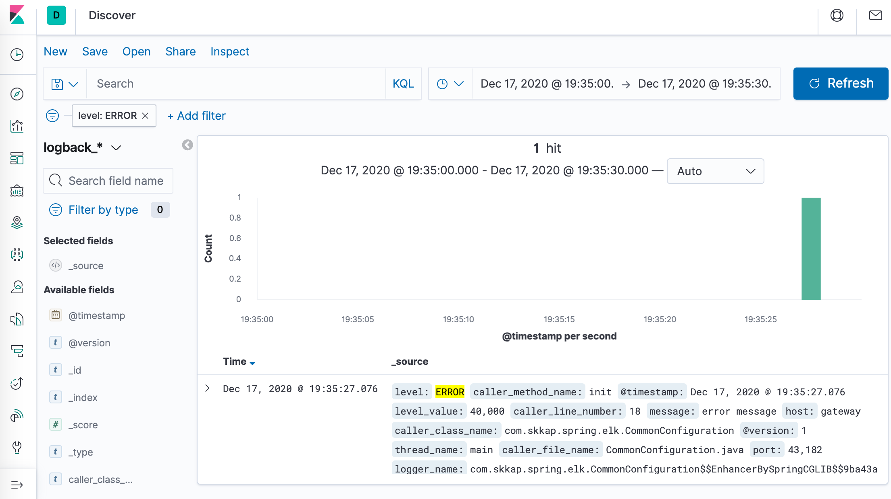

# Spring Boot + Logback + ELK

This project demonstrates how to deliver logs from Spring Boot application to the Elastic Search via Logstash.

## How to run

First start ELK stack. Requires Docker and docker-compose.

```
❯ docker-compose up -d
```

Then build and start Spring Boot application.

```
❯ ./gradlew test-log:bootRun
```

Now you can go to Kibana (http://127.0.0.1:5601/) and check if logs are there.


